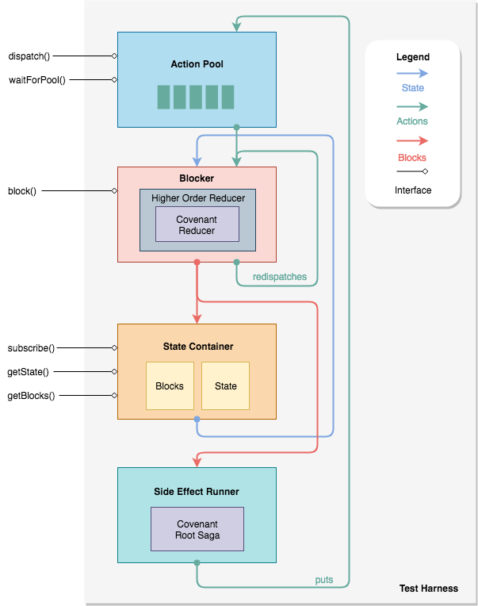

# How the test harness works




## Harness dataflow

The diagram above shows the components of the test harness and how data
flows through them. The legend indicates the types of data that move
between the components.

When a harness is created, a `reducer` and `rootSaga` are placed into
the blocker and side-effect runner, respectively. From that point on,
the harness can be used to run actions through the `reducer` and
`rootSaga` in a similar fashion to Redux, while accumulating the
transaction history in the form of blocks.

In general, the sequence of events in the formation of a block is:

1. The `actionPool` accumulates `actions` to be run through a `reducer`
   at some point in the future.

2. The `blocker` is called, takes all of the `actions` from the pool,
   and runs them sequentially.

3. The final reduced `state` is captured and packaged with the executed
   `actions` in the form of a `block`.

4. The `block` is sent to the state container where it is stored with
   the blocks that came before. The `state` from the `block` is unpacked
   and held as the current `state` of the harness.

5. The `block` is also sent to the side-effect runner, where each of the
   `actions` in the block is run individually through the `rootSaga`.
   They can be listened to using `take` effects. The `state` from the
   block can be grabbed with `select` effects. When an action is `put`
   from a saga, it goes into the `actionPool` to be executed in a future
   `block`.


### A note on `redispatches`

The harness also provides the `redispatch` function that can be imported
with one of the following:

1.  **If you are using the NPM package:**

    ```js
    const { redispatch } = require('interbit-test-harness')
    ```

2.  **If you are using the repo:**

    ```js
    const { redispatch } = require('./test/harness')
    ```

This function takes a `state` and a list of `actions`, and returns a new
state with the `actions` in a special reserved key. The `blocker` knows
how to look at the reserved key and processes its contents immediately
after the action that generated the key. Careless usage of this function
can cause stack overflow errors.

This function should be used for one of the following purposes:

1. Sending actions to other covenants that run alongside this one.

2. Sending actions from this covenant's reducer to its saga. This allows
   the reducer to be used as an interface to the impure behaviour
   contained in the saga.

3. Decoupling a long reducer case into several smaller ones that are
   guaranteed to be run synchronously in one block creation call. This
   allows for behaviours inside a reducer to be broken down and re-used
   from several different reducer entry points.


## How to start a test harness

The test harness requires a covenant to start. Assuming you have a
covenant of the form:

```js
const covenant = {
  reducer: (state, action) => { /* omitted */ return nextState },
  rootSaga: function* () { /* omitted */ }
}
```

The test harness can be started with the following code:

1.  **If you are using the NPM package:**

    ```js
    const { createHarness } = require('interbit-test-harness')
    const harness = createHarness(covenant)
    ```

2.  **If you are using the repo:**

    ```js
    const { createHarness } = require('./test/harness')
    const harness = createHarness(covenant)
    ```

This returns an object with the interface described below.


## The harness interface

The test harness interface is:

```js
{
  dispatch:: Action -> (),
  waitForPool:: PoolPredicate -> Promise<Action>,
  block:: () -> (),
  subscribe:: Callback -> Unsubscribe,
  getState:: () -> Object,
  getBlocks:: () -> Array
}
```

Each of the methods are explained below.


### `dispatch`

Adds an action to the `actionPool`. Actions wait here until a block is
created. A block is created using the `block` method.


### `waitForPool`

Returns a `Promise` that resolves when the `actionPool` is in a state
specified by the `PoolPredicate`. The `PoolPredicate` can be any of the
following types:

1. `undefined`: The `Promise` resolves the next time the pool gets an
   action added to it.

2. `string`: The `Promise` resolves the next time the pool gets an
   action with the type that matches the supplied string.

3. `number`: The `Promise` resolves the next time the pool size is equal
   to the supplied number.

4. `function`: A function with the signature `(Action, ActionPool) ->
   Boolean`. The `Promise` resolves whenever the function returns true.
   The current action being pooled is the first argument, and the rest
   of the pool is the second.

In all cases, the action that was being pooled when the predicate passes
is what gets resolved in the `Promise`.


### `block`

Collects all the actions in the `actionPool` and informs the blocker to
make a block with them. Making a block consists of running each action
through the reducer with the current state, collecting the redispatched
actions and running them, and producing a final state and a list of
actions that were executed.

Blocks are formed even if there are no actions in the pool.


### `subscribe`

Runs the supplied callback function every time the state, managed by the
harness, changes. That is, whenever a new block is made.


### `getState`

Returns the current state being managed by the harness.


### `getBlocks`

Returns the list of blocks that have accumulated by running the harness
so far.
